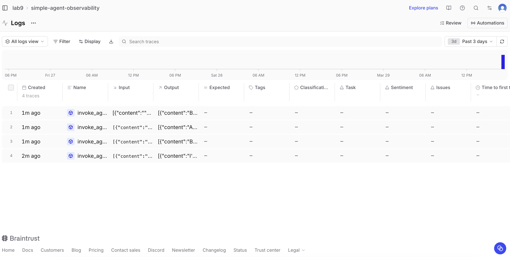
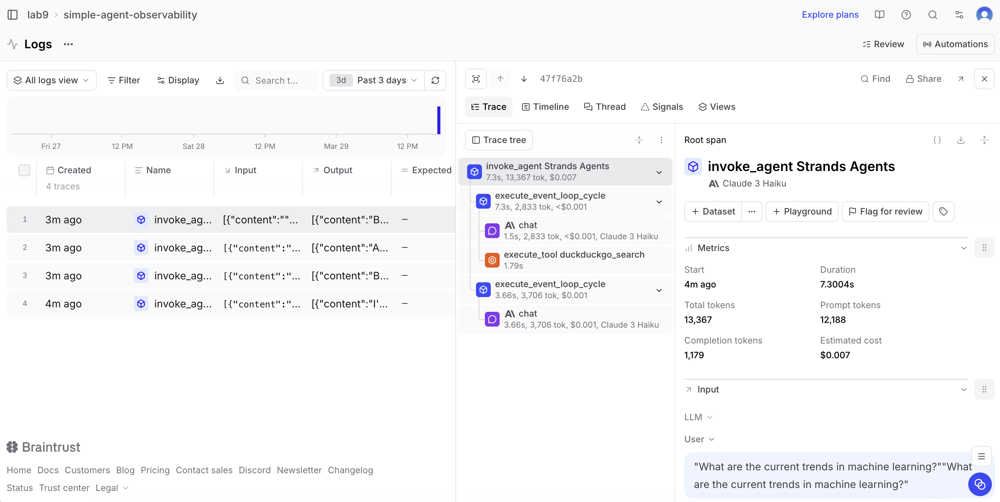
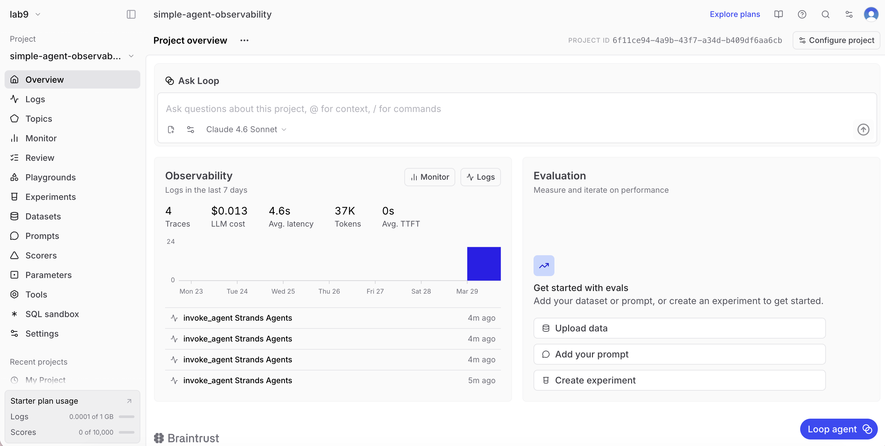

# Braintrust Analysis

   

The Braintrust logs show multipe traces from my agent session. Looking into a trace reveals a hierarcy of spans. The invoke_agent Strands Agent contains execute_event_loop_cycle spans inside it. Those contain the chat spans for each LLM call and a tool duckduckgo_search span when the agent searches the web. So the LLM uses DuckDuckgo and LLM gets the results and writes the response. 

 

The project overview shows the traces totaling $0.013 with an average latency of 4.6 seconds and 37K tokens used across all queries. Looking at the "current trends in machine learning", it uses 12,188 tokens and took 7.3 seconds, costing $0.007. The first trace I just said "test" so I did not ask the LLM to trigger a DuckDuckGo search so it took faster than the rest of the traces that did require the search tool 